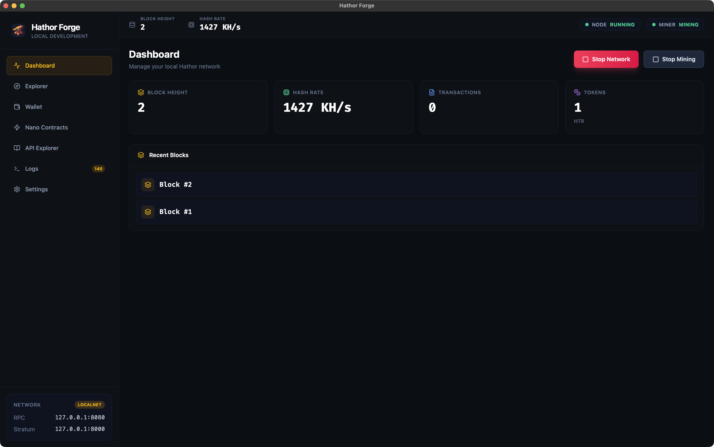
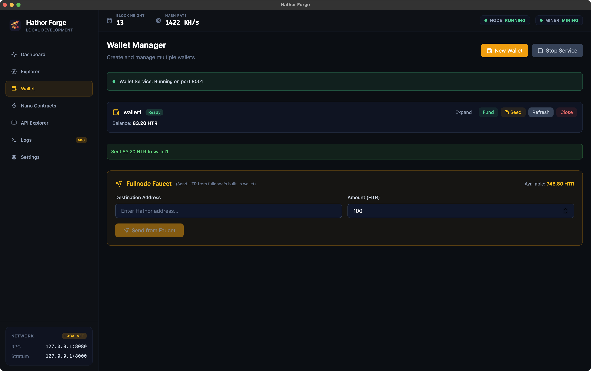

<p align="center">
  
</p>

# Hathor Forge

A local blockchain development environment for [Hathor Network](https://hathor.network). Think Ganache, but for Hathor.

Start a fullnode, mine blocks, create wallets, and send transactions — all locally, zero configuration.

<p align="center">
  
</p>

<p align="center">
  
</p>

## Getting Started

### Option 1: CLI (no GUI needed)

Run directly with Nix — no clone or install required:

```bash
# Start everything: node + miner + wallet service + MCP server
nix run github:HathorNetwork/hathor-forge -- --start

# Start without the miner
nix run github:HathorNetwork/hathor-forge -- --start --no-miner

# Connect wallet-headless to an external node
nix run github:HathorNetwork/hathor-forge -- --wallet-only --fullnode-url http://mynode:8080
```

<details>
<summary>All CLI flags</summary>

| Flag | Description |
|------|-------------|
| `--start` | Auto-start all local services |
| `--wallet-only` | Start only wallet-headless + MCP server |
| `--no-miner` | Skip CPU miner |
| `--no-wallet` | Skip wallet-headless |
| `--no-tx-mining` | Skip tx-mining-service |
| `--fullnode-url <URL>` | Connect to an external fullnode |
| `--tx-mining-url <URL>` | Connect to an external tx-mining-service |
| `--mining-address <ADDR>` | Custom mining reward address |
| `--mcp-port <PORT>` | MCP server port (default: 9876) |
| `--save-settings` | Persist flags to `~/.config/hathor-forge/cli-settings.json` |
| `--settings-file <PATH>` | Custom settings file path |

</details>

### Option 2: Desktop App (GUI)

Download from [Releases](https://github.com/HathorNetwork/hathor-forge/releases) or build from source:

```bash
nix develop      # enter dev shell (or use direnv)
npm install
dev-server       # starts frontend + Tauri
```

## What You Can Do

| Capability | How |
|-----------|-----|
| **Run a local blockchain** | Click "Start Network" or use `--start` |
| **Mine blocks** | Built-in CPU miner starts automatically |
| **Create wallets** | Wallet tab → "New Wallet" (generates seed + address) |
| **Fund wallets** | Click "Fund" to send HTR from the pre-funded faucet |
| **Send transactions** | Expand a wallet → enter address + amount → Send |
| **Browse blocks & txs** | Explorer tab (embedded block explorer) |
| **Test APIs** | API Explorer tab (interactive Swagger UI) |
| **AI integration** | MCP server lets Claude control everything (see below) |

## MCP Server (AI Integration)

Hathor Forge exposes an [MCP](https://modelcontextprotocol.io) server so AI assistants can control the environment programmatically.

### Setup with Claude Code

```bash
# Terminal 1: start Hathor Forge
nix run github:HathorNetwork/hathor-forge -- --start

# Terminal 2: register the MCP server
claude mcp add --transport http hathor-forge http://127.0.0.1:9876/mcp
```

Or add to your project's `.mcp.json`:

```json
{
  "mcpServers": {
    "hathor-forge": {
      "type": "http",
      "url": "http://127.0.0.1:9876/mcp"
    }
  }
}
```

### Setup with Claude Desktop

In the desktop app, go to **Settings → MCP Integration → Copy Config**, then paste into Claude Desktop's config file.

### Available Tools (26)

| Category | Tools |
|----------|-------|
| **Node** | `start_node`, `stop_node`, `get_node_status` |
| **Miner** | `start_miner`, `stop_miner`, `get_miner_status` |
| **Wallet Service** | `start_wallet_service`, `stop_wallet_service`, `get_wallet_service_status` |
| **Wallets** | `generate_seed`, `create_wallet`, `get_wallet_seed`, `get_wallet_status`, `get_wallet_balance`, `get_wallet_addresses`, `send_from_wallet`, `close_wallet` |
| **Faucet** | `get_faucet_balance`, `send_from_faucet`, `fund_wallet` |
| **Blockchain** | `get_blocks`, `get_transaction` |
| **Quick Actions** | `quick_start`, `quick_stop`, `get_full_status`, `reset_data` |

### Example

```
You: "Start the blockchain and create a test wallet with 50 HTR"

Claude: [Uses quick_start, create_wallet, fund_wallet]
        "Done! Node running at block 45, miner active.
         Created wallet 'test' with 50 HTR."
```

## Services & Ports

| Service | Port |
|---------|------|
| Fullnode API | `8080` |
| Stratum (mining) | `8000` |
| Wallet Headless | `8001` |
| Block Explorer | `3001` |
| MCP Server | `9876` |

## Development Wallet (Faucet)

The fullnode starts with a pre-funded HD wallet that receives mining rewards:

```
Address: WXkMhVgRVmTXTVh47wauPKm1xcrW8Qf3Vb
```

> **Warning:** Development only. Never use this seed on mainnet or testnet.

## Troubleshooting

| Problem | Fix |
|---------|-----|
| Node won't start | Check if ports 8080/8000 are in use |
| Wallet stuck at "Starting" | Wait for fullnode to sync (block height increasing) |
| Faucet has no funds | Start the miner, wait for blocks to be mined |
| MCP not connecting | Check `curl http://127.0.0.1:9876/health` returns OK |

## Contributing

```bash
nix develop          # enter dev shell
just check           # cargo check + npm lint
just fmt             # format Rust + JS
just test            # run all tests
```

## License

MIT
